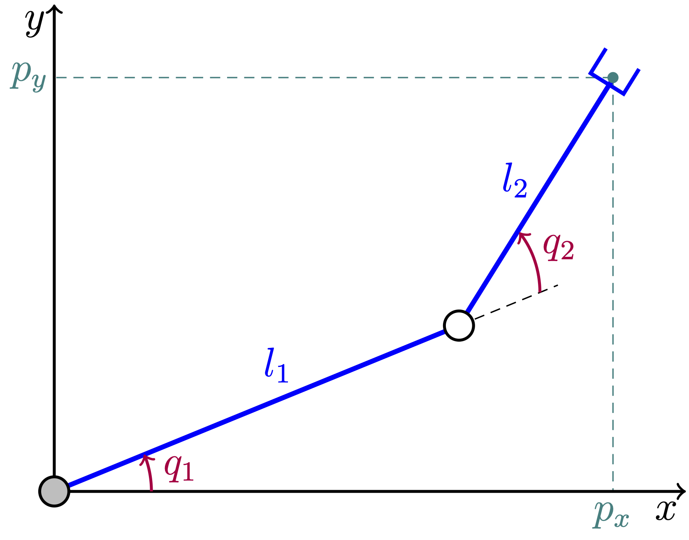

## Introduction to interval computations
Let $C=d\times\pi$ be the circumference of a circle of diameter $d$. Given $d=2$ it comes $$C = 2\times\pi\approx 6.2831853$$
using floating-point arithmetic. Now let $[\pi]=[3.1415926,3.1415927]$ be an _interval enclosure_ of $\pi$, _i.e._ a tight interval that contains $\pi$. An interval enclosure of $C$ is derived by an interval multiplication $$C\in 2\times [\pi] = [6.2831852,6.2831854].$$ As shown above, intervals are useful to bound rounding errors that occur in numerical computations.

More generally, intervals are propagated through numerical algorithms to find interval enclosures of solutions to continuous problems, _e.g._ constraint satisfaction or global optimization problems.

### Interval arithmetic
The resistance of a series circuit with two resistors $R_1$ and $R_2$ is equal to $R = R_1+R_2$. Suppose that the resistors are not exactly known, _e.g._ $R_1=3\Omega$ and $R_2=5\Omega$ plus or minus $1\%$. An interval enclosure
$$R\in [2.97,3.03]+[4.95,5.05] = [7.92,8.08]\Omega$$
follows from an interval addition of the domains of $R_1$ and $R_2$. In this way, interval arithmetic extends real arithmetic to intervals so as to calculate the tightest possible interval enclosures.

This example also shows that intervals are useful to represent uncertain quantities.

### Constraint satisfaction problems
A 2R planar robot with two revolute joints and two links is depicted below.

It is described by the following system of equations:
$$
\left\lbrace
\begin{array}{l}
p_x = l_1\cos(q_1) + l_2\cos(q_1+q_2)\\
p_y = l_1\sin(q_1) + l_2\sin(q_1+q_2)
\end{array}
\right.
$$

The inverse kinematics is the problem of finding the angles $q_1$ and $q_2$ when the position of the end effector $(p_x,p_y)$ is known. Given $(l_1,l_2,p_x,p_y) = (4.5,3,5.75,4.25)$ and $q_1,q_2\in [-\pi,+\pi]$, RealPaver returns two _interval boxes_:
$$
(q_1,q_2)\in\left\lbrace
\begin{array}{l}
[0.38801769, 0.38801771] \times [0.62632835, 0.62632837]\\
[0.88499873, 0.88499874]\times [-0.62632836, -0.62632835]
\end{array}
\right.
$$
Each of these boxes encloses one solution at a given precision $\epsilon=10^{-8}$, _i.e._ the diameter (width) of each output interval is smaller than $\epsilon$. The first solution is depicted in the figure above and the second solution is a symetric one.

The solver implements a _branch-and-prune algorithm_ that alternates pruning (contraction) and branching (separation) steps from the initial interval box $[-\pi,+\pi]^2$. It is guaranteed that no solution is lost. In particular, it is proved that there is no solution when no solution is found.

